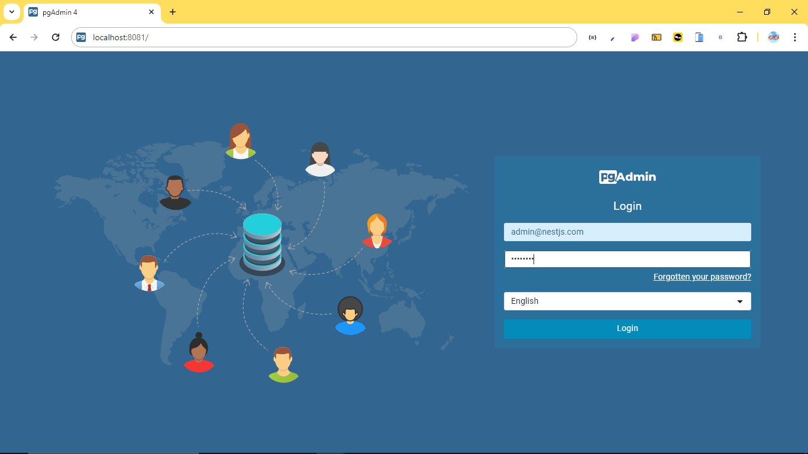
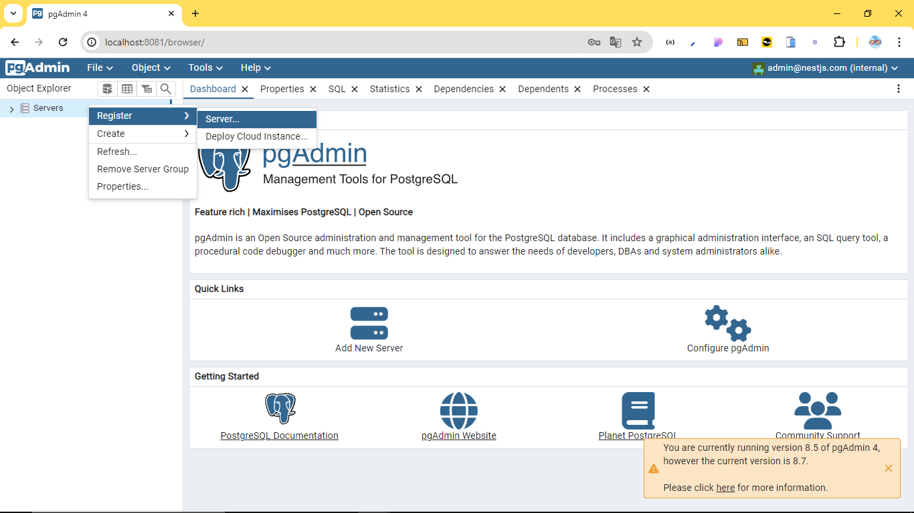
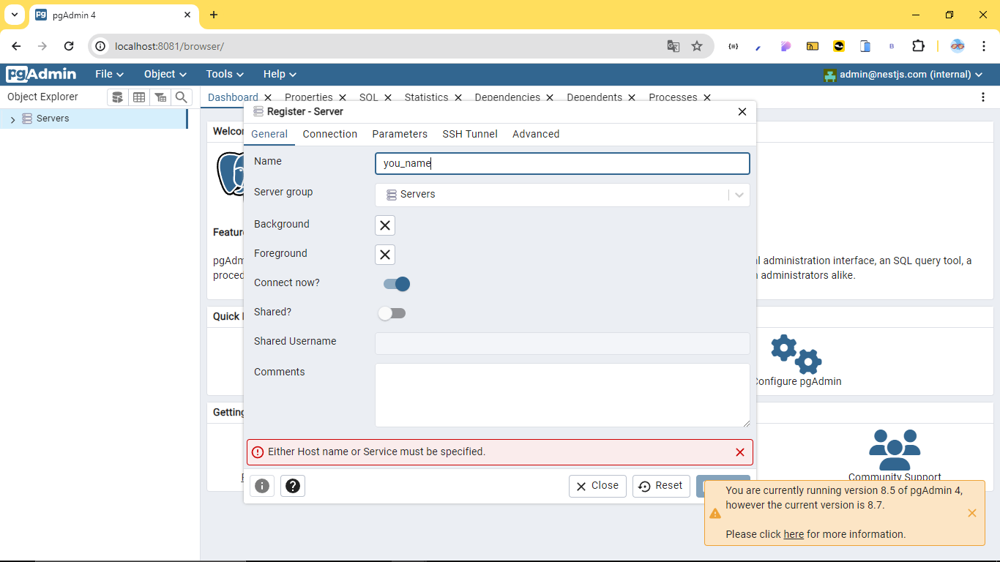
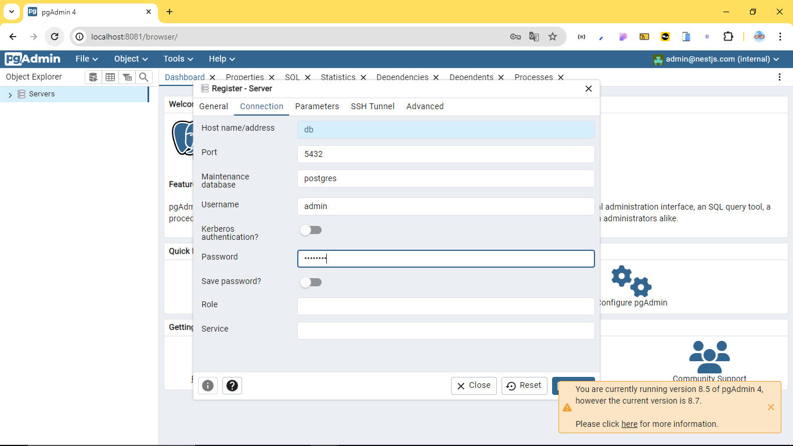
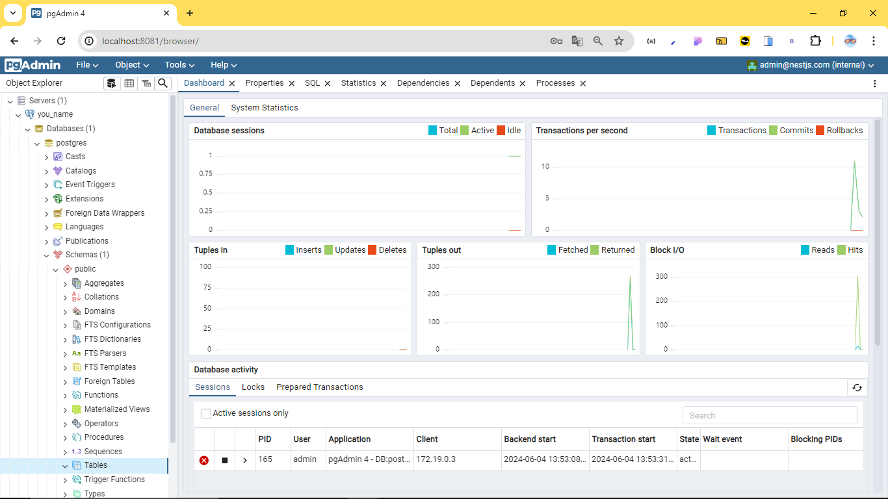

<p align="center">
  <a href="http://nestjs.com/" target="blank"></a>
</p>

[circleci-image]: https://img.shields.io/circleci/build/github/nestjs/nest/master?token=abc123def456
[circleci-url]: https://circleci.com/gh/nestjs/nest

  <p align="center">A progressive <a href="http://nodejs.org" target="_blank">Node.js</a> framework for building efficient and scalable server-side applications.</p>
    <p align="center">
<a href="https://www.npmjs.com/~nestjscore" target="_blank"></a>
<a href="https://www.npmjs.com/~nestjscore" target="_blank"></a>
<a href="https://www.npmjs.com/~nestjscore" target="_blank"></a>
<a href="https://circleci.com/gh/nestjs/nest" target="_blank"></a>
<a href="https://coveralls.io/github/nestjs/nest?branch=master" target="_blank"></a>
<a href="https://discord.gg/G7Qnnhy" target="_blank"></a>
<a href="https://opencollective.com/nest#backer" target="_blank"></a>
<a href="https://opencollective.com/nest#sponsor" target="_blank"></a>
  <a href="https://paypal.me/kamilmysliwiec" target="_blank"></a>
    <a href="https://opencollective.com/nest#sponsor"  target="_blank"></a>
  <a href="https://twitter.com/nestframework" target="_blank"></a>
</p>
  <!--[](https://opencollective.com/nest#backer)
  [](https://opencollective.com/nest#sponsor)-->

## Description

[Nest](https://github.com/nestjs/nest) framework TypeScript starter repository.

## Instructions

Follow these steps to use the API

## Installation

```bash
$ npm install
```
For the API to work you must install postgres to create a container with two images, one with postgreSQL and another with PGAdmin to be able to use the database

- Docker Desktop: https://www.docker.com/products/docker-desktop/

## Steps

```bash
$ docker-compose up
```

this command to be able to run the docker-compose file that is in the root of the project that is going to initialize and unload the two images, if you know about the subject you can modify the file to your liking, remember that for this to work you must have docker open or power on from terminal

<hr>

After this you can go to port 8081, which is by default in the file, or if you modified it you must enter that port from your browser


## Running the app

</img><hr><br>
</img><hr><br>
</img><hr><br>
At this point all that remains is to click on save and that's it, we can now run the application.
</img><hr><br>
</img><hr><br>

use any command to see the program

```bash
# development
$ npm run start

# watch mode
$ npm run start:dev
```

## finalized

When everything is fine you can go to any endpoint or to any of the two routes that appear at the end, the documenting one with swagger or the api as such

# thanks for using the API

## Stay in touch

- Author - [Kamil Myśliwiec](https://kamilmysliwiec.com)
- Website - [https://nestjs.com](https://nestjs.com/)
- Twitter - [@nestframework](https://twitter.com/nestframework)

## License

Nest is [MIT licensed](LICENSE).
